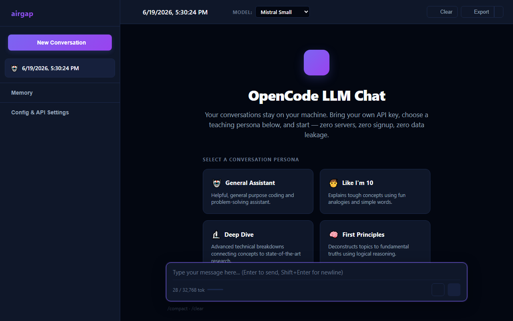

# airgap

[](https://github.com/hasitpbhatt/airgap/actions/workflows/ci.yml)

Every AI agent you've used reports to a server. airgap reports to you.

An autonomous AI agent that runs entirely in your browser. Browse the web, search the internet, read RSS feeds, remember facts across conversations, evaluate math — all through a single HTML file and an API key. No Docker, no npm, no signup, no server.

| 🛡️ Local by design | 🔌 Bring your own key | 📁 One HTML file |
|---|---|---|
| Messages, keys, and context stay in your browser — never uploaded to a third-party server. | Works with Mistral, OpenAI, or any OpenAI-compatible API. You control where queries go. | Zero servers. Zero databases. Zero signup. Open it, configure, and go. |



## Features

- **Web browsing** — Fetch any URL via a proxy (with automatic caching and domain rate-limit handling)
- **Web search** — Searches across SearXNG, DuckDuckGo, Ecosia, Bing, and Brave with automatic fallback
- **RSS reader** — Parses RSS 2.0, Atom, and RSS 1.0/RDF feeds
- **Global memory** — Remember facts across conversations; browse and manage memory from the sidebar
- **File creation** — AI can create files and offer them as browser downloads
- **Charts** — Generate bar, line, and pie charts rendered directly on Canvas (no charting library needed)
- **Notes** — Persistent global note-taking system
- **Clipboard** — Write text to clipboard with user-click confirmation
- **Notifications** — Desktop notifications via Service Worker or Notification API
- **Math evaluation** — Reliable computation using `Math.*` and arithmetic expressions
- **Conversation compaction** — Auto-prunes at 15 messages via `/compact` to stay within context limits
- **Export** — Download conversations as JSON, Markdown, or Plain Text
- **Voice input** — Speech-to-text via Web Speech API (HTTPS required)
- **PWA** — Add to Home Screen on supported browsers

## Quick start

```
git clone https://github.com/hasitpbhatt/airgap.git
cd airgap
```

Open `index.html` in a browser. Paste an API key. Send a message.

Web access uses a Cloudflare Worker (`https://airgap-fetch.gitub.workers.dev/`).

**Test:** `npx playwright test` (requires Chromium, install via `npx playwright install chromium`)

## System requirements

| Requirement | Details |
|---|---|
| **Browser** | Chrome, Firefox, Safari, Edge (recent 2 major versions) |
| **Internet** | Required for initial page load (CDN dependencies) and all LLM API calls |
| **HTTPS** | Required for voice input (Web Speech API) and Service Worker notifications |
| **`file://`** | Works, but no voice input, no service worker, no ES modules (app uses global-scope scripts) |
| **localStorage** | All state persisted here — clearing browser data loses chats and memory |

### Supported LLM providers

Any OpenAI-compatible `/v1/chat/completions` endpoint. Tested with:

- Mistral AI (`mistral-small-latest`, `mistral-medium-latest`, `mistral-large-latest`, `codestral-latest`)
- OpenAI (GPT-4, GPT-4o, o-series)
- Groq
- Together AI
- Perplexity
- Anyscale
- Any custom proxy implementing the same interface

Set the **LLM API Proxy URL** in settings to point to your provider.

## Architecture

```
index.html ──┬── style.css
             ├── manifest.json
             ├── icon.svg
             ├── worker.js          Cloudflare Worker source (deploy separately)
             └── js/ ──┬── constants.js    Tool definitions, state, DOM refs
                       ├── utils.js        Rendering, encoding, helpers
                       ├── storage.js      localStorage abstraction
                       ├── chat.js         Chat CRUD, feed rendering
                       ├── tools.js        24 tool implementations
                       ├── sender.js       API calls, agent loop, pruning
                       └── events.js       Init, event binding, ?k= param
```

Load order is sequential via `<script>` tags (no ES modules — `file://` blocks them). All files share global scope.

```
                  ┌─────────────────┐
                  │   index.html    │
                  │  (entry point)  │
                  └────────┬────────┘
                           │
            ┌──────────────┼──────────────┐
            ▼              ▼              ▼
     ┌──────────┐   ┌──────────┐   ┌──────────┐
     │ Browser  │   │   LLM    │   │   Web    │
     │  UI &    │   │   API    │   │  Fetch   │
     │  Memory   │   │(Mistral, │   │  Proxy   │
     │(localS.) │   │ OpenAI)  │   │ (Worker) │
     └──────────┘   └──────────┘   └──────────┘
```

- **Browser** renders the chat UI, manages localStorage, runs tools
- **LLM API** receives messages + tool definitions, returns text or `tool_calls`
- **Fetch proxy** uses a Cloudflare Worker (`https://airgap-fetch.gitub.workers.dev/`). Source in [`worker.js`](worker.js).

## Configuration

### Settings panel

| Field | Default | Description |
|-------|---------|-------------|
| LLM API Proxy URL | `https://api.mistral.ai/v1/chat/completions` | Any OpenAI-compatible API |
| Tool Fetch Proxy URL | `https://airgap-fetch.gitub.workers.dev/` | Primary web fetch endpoint |
| Backup Fetch Proxy URL | — | Optional fallback if primary proxy fails |
| API Key | — | Stored in localStorage only |
| Model | `mistral-small-latest` | Preset or custom model name |
| System Persona | General | 6 templates or custom prompt |
| Enable Turns Limit | Off | Limits conversation to N rounds of user+assistant turns |
| Max Turns | 5 | Only active when turns limit is enabled |

### Environment injection

When deploying to a static host (Netlify, Vercel, etc.), you can inject a proxy URL via a global variable:

```html
<script>var MISTRAL_PROXY_URL = 'https://your-proxy.com/v1/chat/completions';</script>
```

This is checked by `getInitialProxyUrl()` in `constants.js` before falling back to the default.

### URL injection

`?k=<hex>` obfuscates and injects API key + model + proxy URL:

```
?k=2c13190a12016c2a573e3041072258674161663a...
```

The hex is XOR-encoded (key `_x4`) JSON: `{"k":"sk-...","m":"mistral-small-latest","u":"https://..."}`. Legacy raw-key format is also accepted.

Use the **Share link with credential** button in settings to generate one.

> ⚠️ Anyone with this link can use your API key and burn your tokens — share at your own risk.

### Auto-pruning

When a conversation reaches 15 non-system messages, the agent automatically summarizes and compacts history via `/compact`. Transparent to the user — happens before the next message is sent.

## Agent loop

Each message can trigger up to **10 chained tool calls** (`MAX_TOOL_LOOP = 10`). The agent calls a tool, receives the result, then decides whether to call another tool or return a final response. This enables multi-step workflows like:

1. Search the web for a topic
2. Fetch a specific article
3. Read an RSS feed
4. Save a summary as a note
5. Send a notification

The loop stops when the agent returns a text response or reaches 10 iterations.

## 24 tools

| Tool | Description |
|------|-------------|
| `fetch_url` | Fetch any URL via proxy (with caching and domain rate-limit handling) |
| `search_web` | Parallel search across SearXNG, DuckDuckGo, Ecosia, Bing, Brave |
| `read_rss` | Parse RSS 2.0 / Atom / RSS 1.0 feeds |
| `save_file` | Create a file and offer it as a browser download |
| `generate_chart` | Render a bar, line, or pie chart from data |
| `clipboard_write` | Write text to the clipboard (triggers on user click) |
| `send_notification` | Send a system/desktop notification |
| `set_setting` | Update a chat setting (proxyUrl, modelName, persona) |
| `notes_create` | Create or overwrite a global note |
| `notes_read` | Read a single note by key |
| `notes_list` | List all notes, optionally filtered by query |
| `notes_delete` | Delete a single note by key |
| `store_value` | Per-chat persistent key-value storage |
| `read_value` | Retrieve per-chat stored value |
| `list_stored_keys` | List all keys in current chat |
| `delete_value` | Remove a per-chat stored value |
| `compact` | Summarize and compress conversation history |
| `get_current_time` | Current date, time, timezone |
| `calculate` | Evaluate math expressions (Math.* supported) |
| `remember` | Global cross-chat memory: store |
| `recall` | Global cross-chat memory: retrieve (exact + substring) |
| `forget` | Global cross-chat memory: delete single key |
| `forget_all` | Global cross-chat memory: delete all |

### Search engine fallback chain

`search_web` tries engines in this priority order:

1. **SearXNG** (direct from browser — native JSON API, 5 public instances)
2. **DuckDuckGo** (via fetch proxy)
3. **Ecosia** (via fetch proxy)
4. **Bing** (via fetch proxy)
5. **Brave** (via fetch proxy)

The first engine to return results wins.

### Domain rate-limit handling

`fetch_url` tracks HTTP 429 responses per domain. When a domain returns 429 with a `retry_after` value, the tool auto-blocks that domain and retries via the backup proxy URL.

Tools are defined in `js/constants.js` and implemented in `js/tools.js`. Adding a new tool takes one entry in `AVAILABLE_TOOLS` and one `case` in the dispatch.

## Transparent fetch cache

`fetch_url` caches responses per-chat in localStorage with a 5-minute TTL. Keyed by URL hash. Automatically serves cached content on repeat requests, transparent to the LLM. Content is also stored permanently under `_fetched_<encodedUrl>` in conversation memory — the LLM can re-read it via `read_value` without re-fetching.

## Storage architecture

Three storage layers, all backed by `localStorage`:

| Layer | Scope | Functions | localStorage prefix |
|-------|-------|-----------|-------------------|
| **llmStore** | Per-chat | `llmStoreGet`, `llmStoreSet`, `llmStoreDelete`, `llmStoreListKeys` | `llm_store_<chatId>_` |
| **globalStore** | Cross-chat | `globalStoreGet`, `globalStoreSet`, `globalStoreDelete`, `globalStoreClear`, `globalStoreListKeys` | `global_memory_` |
| **noteStore** | Global notes | `noteStoreGet`, `noteStoreSet`, `noteStoreDelete`, `noteStoreListKeys` | `opencode_notes_` |

## Memory management

The sidebar includes a **Memory** panel that lets you:

- **Search** global memory by keyword
- **Browse** all stored keys
- **Clear all** memory with a single button

This is the UI counterpart to the `remember` / `recall` / `forget` / `forget_all` tools. The panel auto-refreshes when the AI stores or deletes memory.

## Export

Conversations can be exported in three formats from the header bar:

| Format | Extension | Content |
|--------|-----------|---------|
| JSON | `.json` | Full conversation object (including system prompt, metadata) |
| Markdown | `.md` | Formatted markdown with user/assistant labels |
| Plain Text | `.txt` | Plain text transcript |

## Keyboard shortcuts

| Key | Action |
|-----|--------|
| `Enter` | Send message |
| `Shift` + `Enter` | New line |
| `?` | Toggle shortcuts panel |
| `Esc` | Close panel / Cancel editing |
| `Ctrl` + `N` | New conversation |
| `Ctrl` + `B` | Toggle sidebar |

## User commands

| Command | Action |
|---------|--------|
| `/compact` | Summarize and trim history |
| `/clear` | Reset messages, keep system prompt |

## External dependencies

The app loads the following libraries from CDNs on page load. Internet is required for initial rendering even when running from `file://`.

| Library | Purpose | Source |
|---------|---------|--------|
| [marked.js](https://marked.js.org/) | Markdown rendering | jsDelivr |
| [Prism.js](https://prismjs.com/) | Syntax highlighting | Cloudflare |
| [KaTeX](https://katex.org/) | LaTeX equation rendering | jsDelivr |
| [Lucide](https://lucide.dev/) | UI icons | unpkg |

Chart rendering uses the Canvas 2D API directly — no charting library.

## Development

```bash
# Install dependencies
npm install

# Install Playwright Chromium
npx playwright install chromium

# Run tests
npm test
```

Test suite covers 6 spec files across categories:
- **chat.spec.js** — Chat CRUD, rendering, streaming, auto-pruning
- **connect.spec.js** — API key entry, URL injection, share link
- **tools.spec.js** — All 24 tool implementations, proxy formats, error handling
- **edge-cases.spec.js** — Export, rapid messaging, empty states, URL corner cases
- **utils.spec.js** — XOR encoding/decoding, legacy format compatibility
- **helpers.js** — Test utilities (not a spec file)

Tests mock all network requests (CDN scripts, fonts, proxy) via `page.route()`. No real API server needed.

### File conventions

- Functions use `function` keyword declarations (not arrow constants) — ensures global scope via `<script>` tags
- All state lives in `settings`, `chats`, `currentChatId` globals in `constants.js`
- localStorage keys: `opencode_settings`, `opencode_chats`, `opencode_current_chat_id`, `llm_store_<chatId>_*`, `global_memory_*`, `opencode_notes_*`, `_fetch_cache_*`, `_fetched_*`
- Minimal comments; code should be self-documenting

## Deployment

### Cloudflare Worker (fetch proxy)

The file [`worker.js`](worker.js) is a Cloudflare Worker that wraps fetched content in JSON. Deploy it:

```bash
npx wrangler deploy worker.js --name airgap-fetch
```

The client code handles both JSON-wrapped and raw proxy responses, so you can also use any proxy that returns the raw response body.

### Static host (Netlify, Vercel, GitHub Pages)

Serves the chat UI. Web fetch uses the Cloudflare Worker.

To inject a custom LLM proxy URL without modifying the HTML, use the environment variable injection pattern described in [Configuration](#environment-injection).

### Custom proxy

Set the **Tool Fetch Proxy URL** in settings to point to your own proxy endpoint.

### PWA

`manifest.json` and `icon.svg` enable "Add to Home Screen" on supported browsers. Voice input (Web Speech API) requires HTTPS — only works from served origins, not `file://`.

## Limitations

- Voice input requires HTTPS (Web Speech API restriction)
- `file://` blocks ES modules — app uses global-scope scripts
- Google blocks automated requests (HTTP 429) — use `search_web` tool instead
- All state is localStorage — clearing browser data loses chats and memory
- Internet required for initial page load (CDN content) and all LLM API calls
- localStorage size limits vary by browser (~5-10 MB)
- No encryption at rest (localStorage is unencrypted on disk)
- Large conversations may hit per-model context limits (detailed in `CONTEXT_LIMITS` in `constants.js`)

## Privacy

Conversations go directly to the LLM API you configure. No data passes through a middleman. Memory stays in `localStorage` — fully exportable and deletable.

- **No telemetry** — zero analytics, zero tracking, zero background requests
- **No accounts** — no signup, no email, no password
- **No servers** — the HTML file is the app

The entire codebase is open source.

## License

MIT
